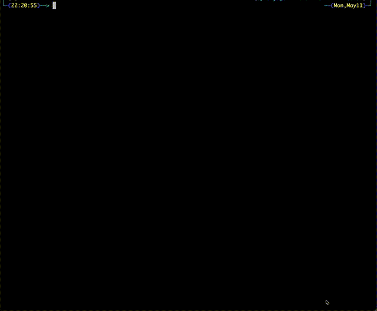
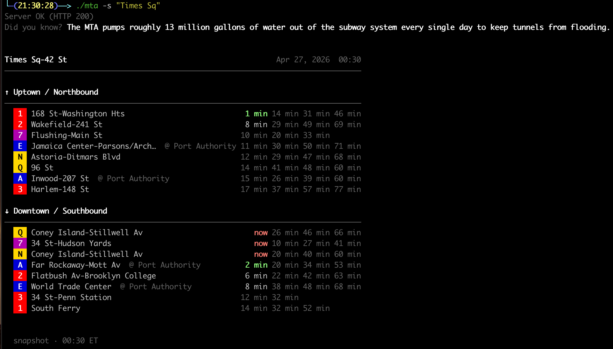
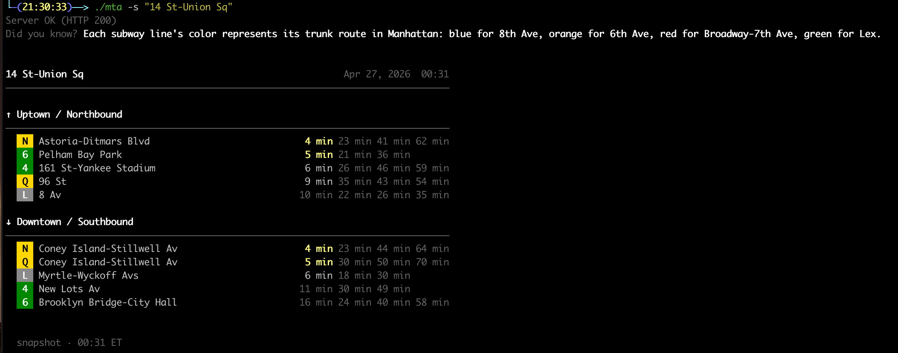
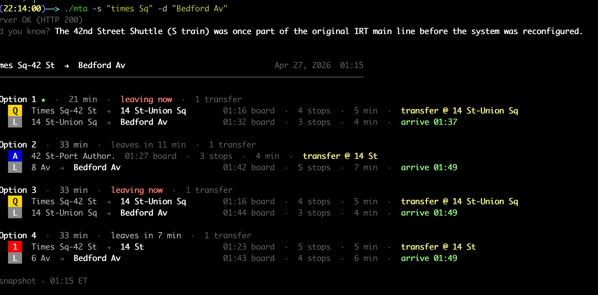
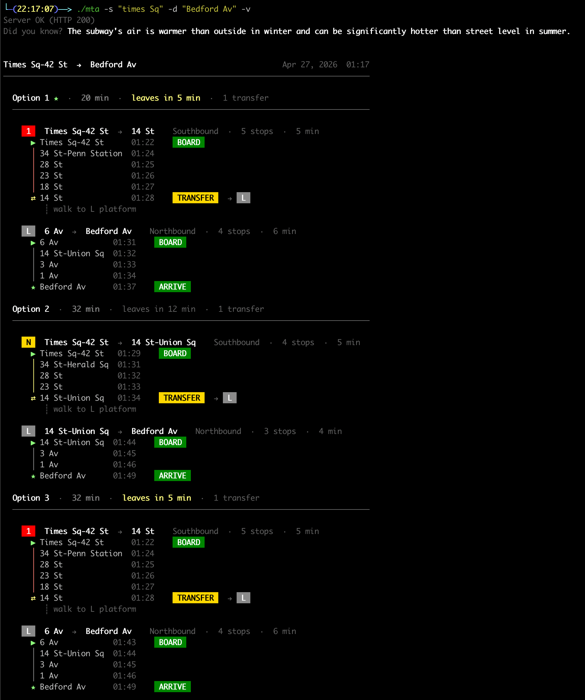
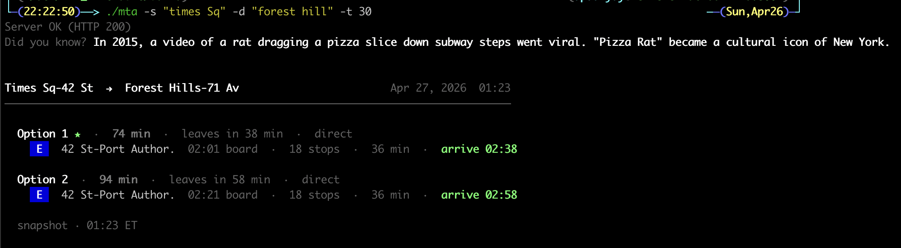
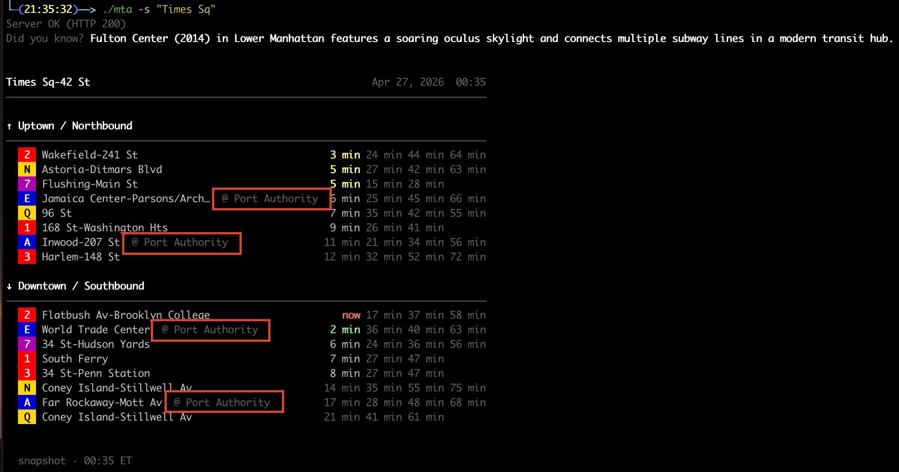
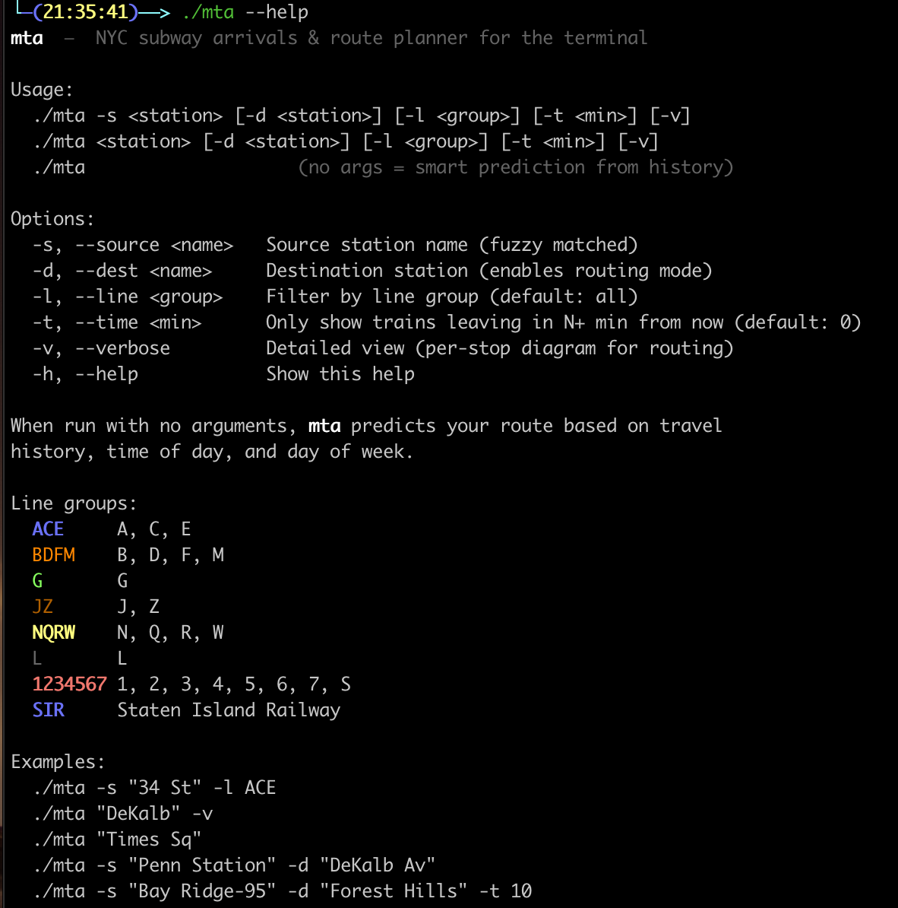
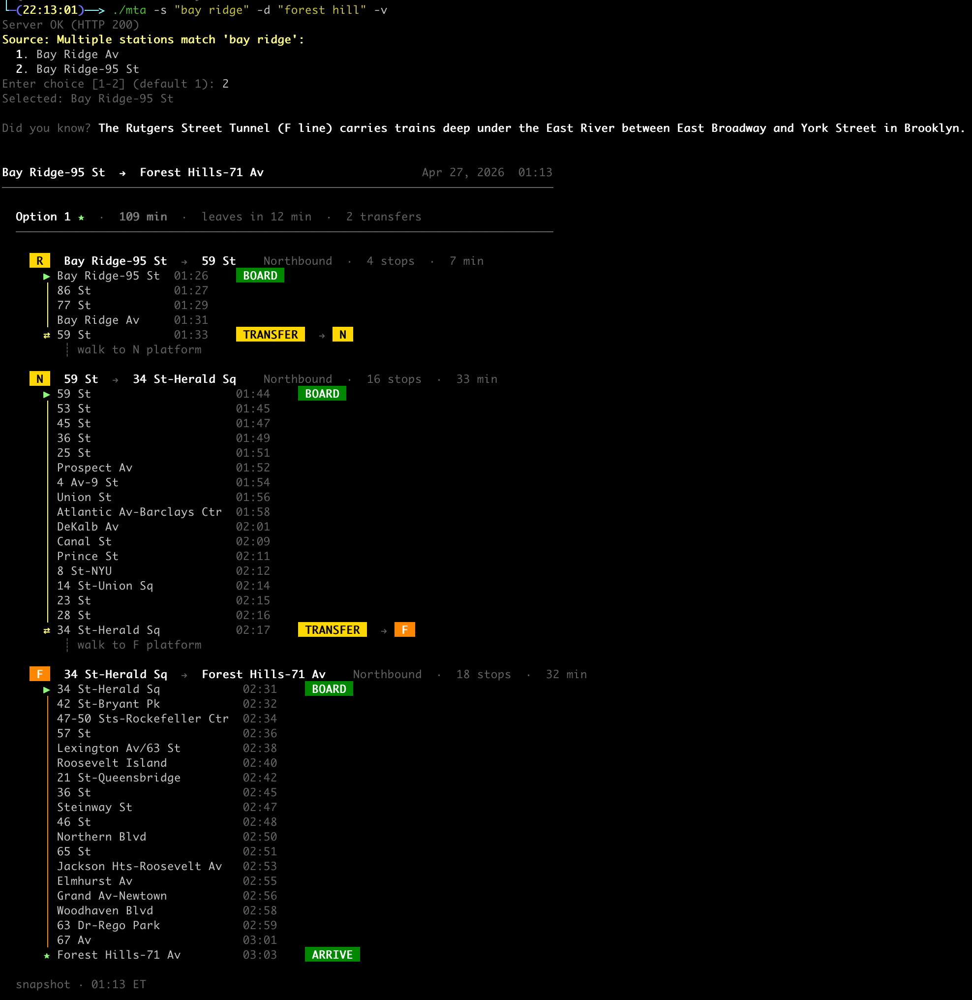

# MTA Timetable

> **A fast, color-coded NYC subway arrival board for your terminal — written in C++.**
> Real-time arrivals, multi-route trip planning, transfer-complex resolution. One command, no app, no API key.



`mta-timetable` is a macOS / Linux command-line tool that pulls live MTA GTFS-realtime feeds and prints either (a) the next subway trains at a station, or (b) the best route between two stations — using NYC-station-display conventions: official MTA line colors, urgency-coded ETAs, and side-by-side direction panels. It's built for people who already live in iTerm2 / Ghostty / Alacritty / kitty and don't want to fish out a phone every time they leave the office.



---

## Quick install (macOS / Linux via Homebrew)

```bash
brew tap itsashishupadhyay/mta
brew install mta
```

Then run it:

```bash
mta --version              # mta 0.1.1
mta -s "Times Sq"          # next trains at every line, both directions
mta -s "Penn Station" -d "DeKalb Av"   # end-to-end route plan
mta --help                 # every flag
```

First install builds from source (cmake + protobuf are pulled as deps), so give it ~2 minutes. To upgrade later: `brew upgrade mta`. To uninstall: `brew uninstall mta && brew untap itsashishupadhyay/mta`.

For a from-source build without Homebrew, see [Install](#install) below.

---

## Table of contents

- [Quick install](#quick-install-macos--linux-via-homebrew)
- [What it does](#what-it-does)
- [How it works (90-second tour)](#how-it-works-90-second-tour)
- [Screenshots](#screenshots)
- [Install](#install)
  - [Homebrew (macOS / Linux)](#homebrew-macos--linux)
  - [From source](#from-source)
- [Usage](#usage)
- [Reading the display](#reading-the-display)
- [Architecture](#architecture)
- [Project layout](#project-layout)
- [Data sources](#data-sources)
- [Refreshing static GTFS data](#refreshing-static-gtfs-data)
- [Regenerating GTFS-RT protobuf bindings](#regenerating-gtfs-rt-protobuf-bindings)
- [Contributing](#contributing)
- [Roadmap](#roadmap)
- [Acknowledgments](#acknowledgments)
- [License](#license)

---

## What it does

In one command:

| Mode | Trigger | Output |
|---|---|---|
| **Arrivals board** | `mta -s "Times Sq"` | Next trains by direction, grouped by `(line, direction, destination)`, with up to 3 follow-up ETAs each. |
| **Route planner** | `mta -s "Times Sq" -d "Bedford Av"` | Up to 5 ranked options — line badges, board / arrive times, transfer points, stop counts. |
| **Verbose route** | add `-v` | Each option expanded into a per-stop diagram with `▶ BOARD`, `⇄ TRANSFER`, `★ ARRIVE` action pills. |
| **Lead-time filter** | `-t N` | Only show options leaving in `N+` minutes (great for "I need 10 min to walk"). |
| **Smart prediction** | `mta` (no args) | Picks your most likely trip from local history, given time of day and day of week. |

Everything is one shell invocation — no daemon, no TUI event loop, no Electron. The binary prints and exits, so it composes cleanly with shell pipes, tmux panes, and Hammerspoon menubar scripts.

### Headline features

- **Real-time arrivals** at any station, grouped by direction (uptown / downtown).
- **NYC-station-display look** — official MTA line bullets (` Q `, ` L `, ` 4 `…) on color backgrounds, the way the signs at every station render them.
- **Time-emphasis coloring** — bold red for "now", bold green for catchable (1–2 min), yellow for soon (3–5 min), white for comfortable (6–9 min), dim for far (10+ min).
- **Grouped arrivals** — same line + direction + destination collapses into one row with up to three follow-up ETAs (`now  10 min  18 min  30 min`), so a busy hub like Times Sq fits on one screen.
- **Connected-complex resolution** — searching `Times Sq` automatically pulls in the A/C/E platforms at *42 St-Port Authority Bus Terminal* via `transfers.txt`, with a dim `@ Port Authority` label so you know where to walk.
- **Route planning** — `mta -s X -d Y` returns the best 5 alternatives via Dijkstra over the live transfer graph, deduped by line pattern.
- **Smart fuzzy station search** — Levenshtein-backed matching means `bedford`, `bedford ave`, `bedfrod` all resolve to *Bedford Av*. When more than one station matches, you get an interactive picker with borough hints to disambiguate.
- **History-based prediction** — running `mta` with no arguments suggests your most likely trip based on usage cached in `./.mta_cache` (kept on your machine, never sent anywhere).
- **Snapshot transparency** — every render shows the feed timestamp so you know how stale the data is.
- **No telemetry, no tracking, no Electron** — single ~2 MB binary, native C++ throughout.

---

## How it works (90-second tour)

The MTA publishes 8 [GTFS-realtime](https://gtfs.org/realtime/) protobuf feeds — one per line group (ACE, BDFM, G, JZ, NQRW, L, numeric, SIR). Each feed is an unauthenticated HTTPS endpoint that returns binary protobuf with the next ~30 minutes of stop-time predictions for every active trip.

`mta` does five things, in order:

1. **Parse arguments** (`source/cli_parser.cpp`) — figure out whether we're in arrivals mode, route mode, or prediction mode.
2. **Resolve the station name** (`source/stop_lookup.cpp`) — fuzzy match against `info/stops.txt`, expand into all directional stop IDs (e.g. `127N`/`127S`) plus every parent station in the same transfer-complex from `info/transfers.txt`.
3. **Fetch feeds** (`source/subway_feed_client.cpp`) — `libcurl` GET, then `protobuf` decode. Routing mode fetches all 8 feeds; arrivals mode fetches only the ones that serve the resolved stops (or just one, if `-l` is set).
4. **Filter / plan** — for arrivals, keep stop-time updates whose `stop_id` is in our expanded set, then sort by ETA. For routing, run Dijkstra in `source/route_planner.cpp` over the (line, station) graph, capped at 5 options and deduped by line pattern.
5. **Render** (`source/output_formatter.cpp`) — terminal-width-aware ANSI output. Side-by-side direction panels at ≥130 cols, single-column below.

The two static files (`stops.txt`, `transfers.txt`) are snapshots from the MTA static GTFS bundle and only need to change when the MTA opens new stations or transfer corridors. Their paths are baked in as compile-time macros so there's zero runtime path-discovery logic.

---

## Screenshots

| | |
|---|---|
| **Arrivals at a busy hub.** Side-by-side direction panels at 130+ cols. Each unique train shows once with follow-ups; ETAs colored by urgency. |  |
| **Multi-option route plan.** `mta -s "Times Sq" -d "Bedford Av"` — three alternatives, each on its own header + one row per leg, all visible without scrolling. |  |
| **Verbose route plan** (`-v`). Per-stop diagram with green `▶ BOARD` / yellow `⇄ TRANSFER → [L]` / green `★ ARRIVE` pills. |  |
| **Lead-time filter.** `mta -s "Bay Ridge-95" -d "Forest Hills" -t 10` shifts the planner clock so it returns options that leave 10+ minutes from now. |  |
| **Connected-complex resolution.** A search for *Times Sq* surfaces the A/C/E trains at the connected *42 St-Port Authority* platforms, dim-labeled so you know where to walk. |  |
| **Help.** `mta --help` lists every flag, line group, and example. |  |

### Verbose multi-option route plan, in full

When you combine `-v` with a long-distance trip and a lead-time filter, `mta` lays out **every option** as its own per-stop diagram so you can pick the one that fits how you like to ride. Each option starts with a colored summary header (`★` on the recommended one), then expands into a per-stop strip with `▶ BOARD`, `⇄ TRANSFER → [next line]`, and `★ ARRIVE` pills.

The example below is `mta -s "Bay Ridge-95" -d "Forest Hills" -t 10 -v` — the recommended option (`★`) shown in full per-stop detail. Every transfer point is a station that's actually physically connected per the MTA's `transfers.txt`, so what you see is what you can do:



Reading top-to-bottom gives you the full picture of the leg: which station to board, every intermediate stop with its arrival time, where exactly to transfer, and what time you arrive.

---

## Install

### Homebrew (macOS / Linux)

```bash
brew tap itsashishupadhyay/mta
brew install mta
```

That's it — `mta --help` from anywhere on your `$PATH`. The formula regenerates the GTFS-realtime protobuf bindings against your installed `protobuf`, so the binary's ABI always matches the libprotobuf it links to.

To upgrade later: `brew upgrade mta`. To remove: `brew uninstall mta && brew untap itsashishupadhyay/mta`.

### From source

`mta-timetable` builds and runs anywhere with a C++17 compiler. On a modern Mac the whole flow takes ~30 seconds.

#### Prerequisites

| Dependency | Why | macOS install | Linux (Debian/Ubuntu) |
|---|---|---|---|
| **CMake** ≥ 3.10 | Build system | `brew install cmake` | `sudo apt-get install cmake` |
| **C++17 compiler** | Apple Clang from Xcode CLT works | `xcode-select --install` | `sudo apt-get install g++` |
| **libcurl** | HTTP fetches against MTA feeds | Ships with macOS | `sudo apt-get install libcurl4-openssl-dev` |
| **Protocol Buffers** ≥ 3.0 | Decode GTFS-realtime binary feeds | `brew install protobuf` | `sudo apt-get install libprotobuf-dev protobuf-compiler` |
| **Abseil** | Required by recent protobuf | `brew install abseil` | `sudo apt-get install libabsl-dev` |

#### Build

```bash
git clone https://github.com/itsashishupadhyay/NYC_MTA_Timetable.git
cd NYC_MTA_Timetable
cmake -B build
cmake --build build -j4
./build/mta -s "Times Sq"
```

That's it. The binary is self-contained — no Python, no Node, no runtime.

#### Install on PATH

```bash
sudo install -m 0755 build/mta /usr/local/bin/mta
mta -s "Times Sq"
```

#### Build flavors

```bash
# Default (release-ish, no debug noise):
cmake -B build

# Verbose mode — prints "Server OK (HTTP 200)" and writes ./output.txt with
# the full decoded feed on every fetch. Useful when investigating a feed
# discrepancy or reverse-engineering an unusual trip pattern.
cmake -B build -DMTA_DEBUG=ON

# Standard CMake build types:
cmake -B build -DCMAKE_BUILD_TYPE=Release
cmake -B build -DCMAKE_BUILD_TYPE=Debug
```

---

## Usage

```text
mta [-s STATION] [-d STATION] [-l LINE] [-t MIN] [-v] [-h]
```

| Flag | Effect |
|---|---|
| `-s, --source <station>` | Source station — fuzzy-matched, e.g. `"14 st"`, `"union sq"`, `"bedfrod"` |
| `-d, --dest <station>` | Destination — switches to **route planning** mode |
| `-l, --line <group>` | Restrict arrivals to one feed group: `ACE`, `BDFM`, `G`, `JZ`, `NQRW`, `L`, `1234567`, `SIR` |
| `-t, --time <min>` | Hide trains/options leaving in less than `<min>` minutes from now (default `0`) |
| `-v, --verbose` | Detailed view — per-stop diagram in route mode, full timeline in arrivals mode |
| `-h, --help` | Print the full help text |

A bare positional argument is treated as `--source`, so `mta "Times Sq"` works too. Running `mta` with no arguments invokes **prediction mode**, which suggests trips based on `./.mta_cache`.

### Common recipes

```bash
# Next trains at Union Sq, all directions, all lines:
mta -s "Union Sq"

# Just the L:
mta -s "Bedford Av" -l L

# Best route Times Sq → Bedford, all options visible at once:
mta -s "Times Sq" -d "Bedford Av"

# Same trip, with full per-stop diagram and color-pill action cues:
mta -s "Times Sq" -d "Bedford Av" -v

# I'm 10 minutes from the station — only show options I can actually catch:
mta -s "Bay Ridge-95" -d "Forest Hills" -t 10

# Whatever I'd usually take right now (uses ./.mta_cache):
mta
```

### Exit codes

| Code | Meaning |
|---|---|
| `0` | Render succeeded |
| `1` | Network / feed error, no matching station, or bad flag |

---

## Reading the display

- **Line badge** (` Q `, ` L `, ` 4 `): MTA's official rondelle, rendered with the matching color background. Yellow lines (NQRW) get a black letter for legibility; everything else uses white.
- **Primary ETA color**:
  - `now` (≤ 0 min): **bold red** — the train is arriving / leaving now.
  - `1–2 min`: **bold green** — go now.
  - `3–5 min`: **yellow** — soon.
  - `6–9 min`: white — comfortable.
  - `10+ min`: dim — far out.
- **Follow-up ETAs**: dim minutes-from-now for the next 1–3 trains of the same `(line, direction, destination)`. `now  10 min  18 min  30 min` reads as "next is now, then in 10, 18, and 30 minutes from current time."
- **`@ <platform>` suffix** (dim): the train is at a connected platform with a *different* name from your search. For example, A/C/E trains at *Times Sq* are physically at *42 St-Port Authority Bus Terminal* — the suffix tells you to walk.
- **Snapshot footer**: the time the data was fetched, in NY time. Stale-aware by design.

In route plans:
- `★` on **Option 1** marks the planner's recommended option (fewest transfers, then fastest).
- `▶ BOARD`, `⇄ TRANSFER → [L]`, `★ ARRIVE` pills appear in `-v` mode with solid color backgrounds for unmistakable visual cues.

---

## Architecture

```
┌────────────┐     8 GTFS-RT feeds      ┌─────────────────┐
│  MTA api   │ ───────────────────────▶ │ subway_feed_    │
│ -endpoint. │   protobuf over HTTPS    │ client (curl +  │
│  mta.info  │                          │ protobuf)       │
└────────────┘                          └────────┬────────┘
                                                 │ DetailedTripUpdate
                                                 ▼
┌──────────────┐    fuzzy match     ┌──────────────────────┐
│  CLI parse   │ ─────────────────▶ │ stop_lookup          │
│ (cli_parser) │   transfer-complex │ (stops.txt +         │
└──────┬───────┘    expansion       │  transfers.txt)      │
       │                            └──────┬───────────────┘
       │                                   │ StationMatch
       ▼                                   ▼
┌──────────────────────────────────────────────────────────┐
│  Source-only mode:                                       │
│    filter trips to {station N/S stops × complex parents} │
│    sort by ETA, group by (route, dir, dest, platform),   │
│    apply -t lead-time filter                             │
│  Routing mode:                                           │
│    findRoutes() — Dijkstra over transfer graph,          │
│    capped at 5 options + dedup by line pattern           │
└────────────────┬─────────────────────────────────────────┘
                 ▼
┌──────────────────────────────────────────┐
│  output_formatter (ANSI-aware,           │
│  width-adaptive, terminal-detect)        │
└──────────────────────────────────────────┘
```

### Design choices

- **One-shot CLI, not a TUI.** `mta` prints and exits. Composes naturally with shell pipes (`mta -s X | grep N`), tmux panes, and Hammerspoon menubar scripts.
- **Side-by-side panels** above ~130 cols, single-column below — chosen so destination names never get arbitrarily truncated on small terminals.
- **Fixed-column timing block** so primary + 3 follow-up ETAs align across every row, regardless of how many actual follow-ups exist.
- **Compile-time data files.** `stops.txt`, `transfers.txt`, and `MTA_facts.txt` paths are baked in via CMake `target_compile_definitions` — no runtime path resolution, no XDG fuss.
- **Cache lives alongside the binary** as `.mta_cache` (relative path, current working directory).

---

## Project layout

```
.
├── CMakeLists.txt              # build configuration
├── main.cpp                    # CLI entry — argparse, dispatch, fetch loop
├── include/
│   ├── ansi_colors.h           # MTA palette + line badges + width helpers
│   ├── cli_parser.h            # CliOptions + parseArgs
│   ├── gtfs-realtime.pb.h      # generated protobuf (large; do not hand-edit)
│   ├── mta_cache.h             # local trip-history cache for prediction mode
│   ├── mta_subway_feed.h       # endpoint URLs, line-group constants
│   ├── output_formatter.h      # render structs (TrainDisplay)
│   ├── route_planner.h         # findRoutes() + RoutePlan/Segment types
│   ├── server_pinger.h         # health-check helper
│   ├── stop_lookup.h           # stops.txt + transfers.txt loader, fuzzy match
│   ├── subway_feed_client.h    # GTFS-RT fetch + parse
│   └── time_helper.h           # America/New_York time formatting
├── source/                     # implementations matching the headers above
├── info/
│   ├── stops.txt               # static GTFS — station table
│   ├── transfers.txt           # static GTFS — transfer-complex graph
│   └── MTA_facts.txt           # trivia shown occasionally
├── gtfs-realtime.proto         # upstream protobuf schema, kept for reference
└── README.MD                   # you are here
```

---

## Data sources

| Source | What we use it for | Where |
|---|---|---|
| MTA GTFS-realtime feeds | Live trip updates, ETAs, route IDs | `https://api-endpoint.mta.info/Dataservice/mtagtfsfeeds/nyct%2Fgtfs-*` (8 feed URLs in `include/mta_subway_feed.h`) |
| MTA static GTFS bundle | `stops.txt` (station IDs, names, lat/lon) and `transfers.txt` (connected complexes) | [`gtfs_subway.zip`](https://rrgtfsfeeds.s3.amazonaws.com/gtfs_subway.zip) |
| Google Transit `gtfs-realtime.proto` | Protobuf schema for decoding the realtime feeds | [google/transit on GitHub](https://github.com/google/transit/tree/master/gtfs-realtime) |

The realtime feeds are public and unauthenticated as of the MTA's 2020 API simplification. There's no API key to register. (The MTA developer portal at <https://api.mta.info/> documents the endpoints; the actual host they resolve to is `api-endpoint.mta.info`.)

---

## Refreshing static GTFS data

The repo ships with `info/stops.txt` and `info/transfers.txt`, snapshots from the MTA static GTFS bundle. The MTA occasionally adds new stations or transfer-complexes; refresh them with:

```bash
curl -sL -o /tmp/gtfs.zip https://rrgtfsfeeds.s3.amazonaws.com/gtfs_subway.zip
unzip -p /tmp/gtfs.zip stops.txt     > info/stops.txt
unzip -p /tmp/gtfs.zip transfers.txt > info/transfers.txt
cmake --build build -j4   # rebuild — these are baked in via compile-time macros
```

---

## Regenerating GTFS-RT protobuf bindings

The pre-generated `gtfs-realtime.pb.{h,cc}` are committed to keep the build single-step. If Google updates the GTFS-realtime spec and you want fresh bindings:

```bash
brew install protobuf       # if not already
cd /tmp
curl -L -o gtfs-realtime.proto \
  "https://raw.githubusercontent.com/google/transit/master/gtfs-realtime/proto/gtfs-realtime.proto"
protoc --cpp_out=. gtfs-realtime.proto
mv gtfs-realtime.pb.h  /path/to/NYC_MTA_Timetable/include/
mv gtfs-realtime.pb.cc /path/to/NYC_MTA_Timetable/source/
```

---

## Contributing

Issues and pull requests are welcome. A few guidelines so we stay aligned:

### Where things live

- **CLI behavior** lives in `main.cpp` and `source/cli_parser.cpp`.
- **Anything that touches a feed** goes in `source/subway_feed_client.cpp` (HTTP + protobuf decode) — keep `libcurl` and `protobuf` calls confined here.
- **Station name resolution** is in `source/stop_lookup.cpp`. Read it before adding a new fuzzy-match rule; the station picker logic in `main.cpp` depends on its scoring conventions.
- **Routing logic** is in `source/route_planner.cpp`. The `findRoutes()` function is the single entry point.
- **Anything visual** (colors, badges, layout, width math) goes in `include/ansi_colors.h` + `source/output_formatter.cpp`. **Don't sprinkle raw `\033[...m` escapes elsewhere** — the centralized palette makes recoloring or accessibility tweaks much easier.

### Coding norms

- **Keep the binary single-file and dependency-light.** New features that pull in heavy libraries need a strong case.
- **Don't slow startup past ~3 seconds** on a typical fiber connection. The fast path is the unauthenticated MTA realtime fetch — anything that would slow it should be opt-in.
- **Match the existing layout idiom**: side-by-side panels for ≥ 130 cols, single-column below; fixed-column timing block; MTA palette for line bullets.
- **No emoji in source files** unless the user-facing string is intentionally an emoji (the action pills `▶`, `⇄`, `★` are deliberate; new emojis aren't).

### Submitting a change

1. Fork and branch off `master`.
2. Build with `cmake -B build && cmake --build build -j4`. Confirm no warnings on Apple Clang or GCC.
3. Run the binary against a few stations to confirm rendering hasn't regressed at common widths (80, 100, 130, 160).
4. If you touched the realtime path, run with `-DMTA_DEBUG=ON` once and skim the `output.txt` dump to confirm fields you don't intend to change are unchanged.
5. Open a PR that explains *why* — what user problem the change addresses. Screenshots help a lot for visual changes.

### Reporting a bug

Please include:

- The exact command you ran.
- Your terminal width (`tput cols`) and emulator (iTerm2, Ghostty, etc.).
- The output you got vs what you expected.
- The output of `cmake --version` and `protoc --version`.

---

## Roadmap

- [x] Homebrew tap — `brew tap itsashishupadhyay/mta && brew install mta`.
- [ ] `--watch` / `--tui` mode with auto-refresh and `j/k` navigation (lazygit-style).
- [ ] Service-alert integration (planned diversions, suspensions).
- [ ] First-run setup that saves a "home station" so bare `mta` is even more useful.
- [ ] Best-train-car / best-exit hints (Citymapper-style) where the data supports it.
- [ ] `--json` / `--plain` output modes for shell scripting.

---

## Acknowledgments

- The **MTA** for publishing GTFS-realtime feeds without an API key.
- **lazygit, k9s, btop, fzf, atuin** — the TUI/CLI tools whose UX standards this project tries to live up to.
- **Andrew Dickinson's [`nyct-gtfs`](https://github.com/Andrew-Dickinson/nyct-gtfs)** for the clearest write-up I've seen on the *quirks* of MTA's realtime data (ghost trains, mutating IDs).
- The protobuf and Abseil teams at Google.

---

## License

Released under the **MIT License** — see [`LICENSE`](LICENSE) for the full text. In short: do what you want with it, just keep the copyright notice intact.

---

## Appendix: screenshot recipes for maintainers

When refreshing the screenshots, run each command in a clean terminal at the specified width and save the PNG with the suggested filename. Screenshots are checked into `Images/` so the README renders without network requests.

| Filename | Terminal width (cols) | Command | What it should show |
|---|---:|---|---|
| `Images/01-arrivals-hero.png` | 140 | `mta -s "Times Sq"` | The marquee shot — side-by-side panels, multiple line groups, mix of `now` / green / yellow / dim ETAs. |
| `Images/02-arrivals-wide.png` | 140 | `mta -s "14 St-Union Sq"` | Another side-by-side example with 4/5/6 + L + N/Q/R lines, several lines visible at once. |
| `Images/04-route-plan.png` | 130 | `mta -s "Times Sq" -d "Bedford Av"` | 2–3 options stacked, each on a 1-line header + 2 leg rows, `★` on Option 1. |
| `Images/05-route-plan-verbose.png` | 130 | `mta -s "Times Sq" -d "Bedford Av" -v` | Per-stop diagram with `▶ BOARD` / `⇄ TRANSFER → [L]` / `★ ARRIVE` colored pills. |
| `Images/06-lead-time-filter.png` | 130 | `mta -s "Bay Ridge-95" -d "Forest Hills" -t 10` | Several options now appear; show that the planner found trains 10+ min out. |
| `Images/07-connected-complex.png` | 130 | `mta -s "Times Sq"` | Crop to a section showing the dim `@ Port Authority` suffix on A/C/E trains. |
| `Images/08-help.png` | 100 | `mta --help` | Full help screen, color-coded line groups visible. |
| `Images/09-route-verbose-multi-1.png` | 130 | `mta -s "Bay Ridge-95" -d "Forest Hills" -t 10 -v` | Crop to **Option 1 only** — the starred recommendation, every leg with per-stop detail. |

